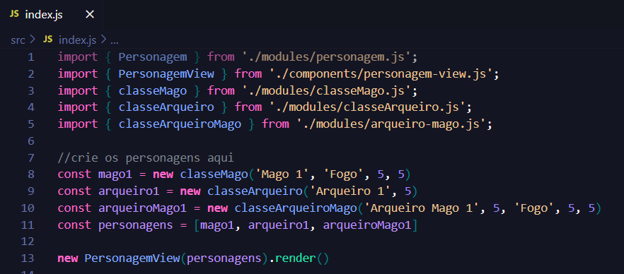
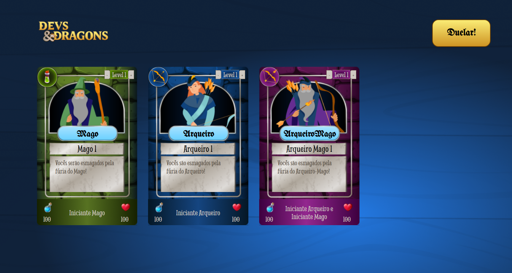
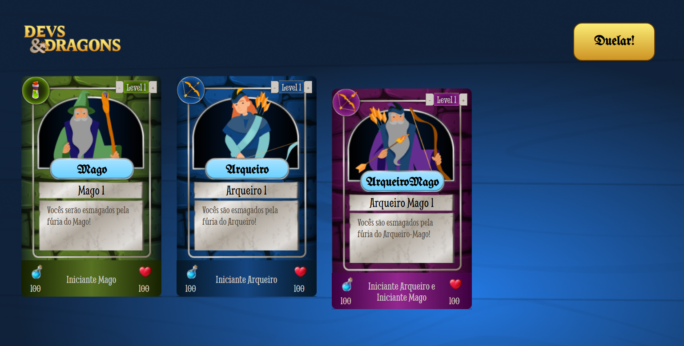
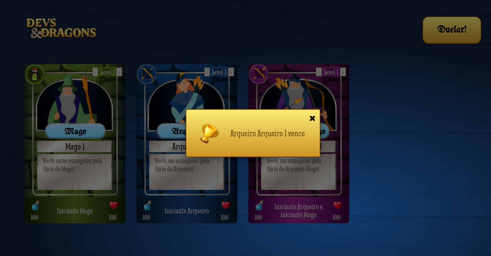

# Devs&Dragons

Este repositório contém os estudos e práticas sobre **Programação Orientada a Objetos (POO)** com foco em **JavaScript moderno**. 

Oriundas do curso **[JavaScript: classes e heranças no desenvolvimento de aplicações com orientação a objetos](https://cursos.alura.com.br/course/javascript-orientacao-a-objetos)** aula aborda conceitos fundamentais de Interfaces, Polimorfismo, Composição vs Herança entre outros.

## Screenshots

**Inicio da aplicação: crie o personagem pela sua classe**

**Aumente o level do personagem**

**selecione os Personagens**

**Clique no botão DUELAR!**

## Próximos passos de Desenvolvimento
Criar uma pagina onde o usuário crie seu próprio personagem direto na tela, sem necessitar acessar o código.
